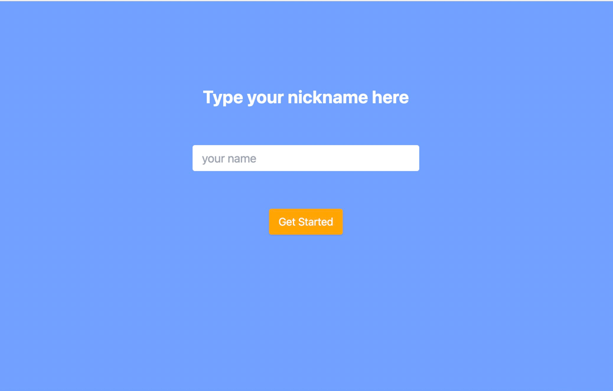
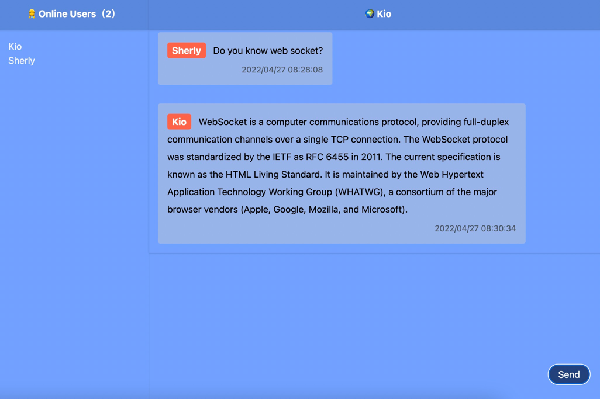
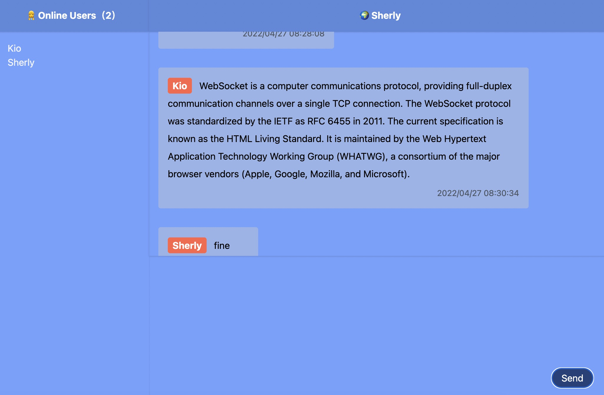

# WebSocketChatDemo
[English](README-CN.md)

This project uses `SpringBoot` to implement a simple multi-person chat application.

### Steps for usage
* startup the project
* Open the project URL through a browser (must support `WebSocket`)
* Enter nickname
* Send and receive messages

### Screenshots

Nickname input

Chatpage

